# CI/CD PIPELINE FOR A PHP BASED APPLICATION
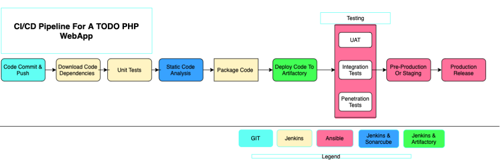


## Project Background
In this project, I will be setting up a CI/CD Pipeline for a PHP based application. The overall CI/CD process looks like the architecture above.

This project is architected with two major repositories with each repository containing its own CI/CD pipeline written in a Jenkinsfile

- ansible-config-mgt REPO: this repository contains JenkinsFile which is responsible for setting up and configuring infrastructure required to carry out processes required for our application to run. It does this through the use of ansible roles. This repo is infrastructure specific
- PHP-todo REPO : this repository contains jenkinsfile which is focused on processes which are application build specific such as building, static code analysis, push to artifact repository etc

### Prerequisites
Will be making use of AWS virtual machines for this and will require 6 servers for the project which includes: Nginx Server: This would act as the reverse proxy server to our site and tool.

**Jenkins server**: To be used to implement your CI/CD workflows or pipelines. Select a t2.medium at least, Ubuntu 20.04 and Security group should be open to port 8080

**SonarQube server**: To be used for Code quality analysis. Select a t2.medium at least, Ubuntu 20.04 and Security group should be open to port 9000

**Artifactory server**: To be used as the binary repository where the outcome of your build process is stored. Select a t2.medium at least and Security group should be open to port 8081

**Database server**: To server as the databse server for the Todo application

**Todo webserver**: To host the Todo web application. This will run on RHEL. 

## Environments
Ansible inventory should look like this 
```
├── ci
├── dev
├── pentest
├── pre-prod
├── prod
├── sit
└── uat

```

ci inventory file
```
[jenkins]
<Jenkins-Private-IP-Address>

[nginx]
<Nginx-Private-IP-Address>

[sonarqube]
<SonarQube-Private-IP-Address>

[artifact_repository]
<Artifact_repository-Private-IP-Address>
```

dev Inventory file
```
[tooling]
<Tooling-Web-Server-Private-IP-Address>

[todo]
<Todo-Web-Server-Private-IP-Address>

[nginx]
<Nginx-Private-IP-Address>

[db:vars]
ansible_user=ec2-user
ansible_python_interpreter=/usr/bin/python

[db]
<DB-Server-Private-IP-Address>
```

pentest inventory file
```
[pentest:children]
pentest-todo
pentest-tooling

[pentest-todo]
<Pentest-for-Todo-Private-IP-Address>

[pentest-tooling]
<Pentest-for-Tooling-Private-IP-Address>
```

# CONFIGURING ANSIBLE FOR JENKINS DEPLOYMENT

We create a Jenkins-server with a t2.medium specification because we will be needing more compute power to run builds. 

## Prepare your Jenkins server
Connect to your Jenkins instance on VScode via SSH and set up SSH-agent to ensure ansible get the private jey required to connect to all other servers:
```
eval `ssh-agent -s`
ssh-add <path-to-private-key>
```

## Install the following packages and dependencies on the server:

These will be used to aid in the code development and deployment 

-Install git : sudo apt install git

- Clone down the Asible-config-mgt repository: git clone https://github.com/nwamsamson/ansible-config-mgt.git

- Install Jenkins and its dependencies.

- Configure Ansible For Jenkins Deployment.

- Navigate to Jenkins URL: :<public-ip-address:8080>

- Install the blueocean plugin for jenkins (In the Jenkins dashboard, click on Manage Jenkins -> Manage plugins and search for Blue Ocean plugin. Install and open Blue Ocean plugin.)

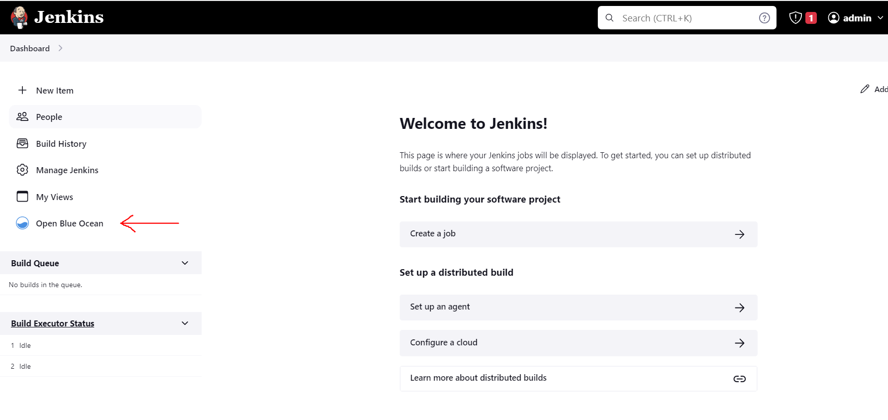

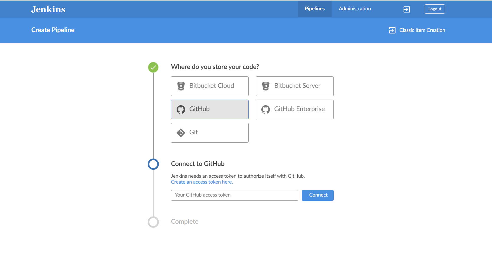

# Creating Jenkinsfile 
Vscode will be used to connect to the server and most of the development work and interaction with the server will be done via vscode.
- inside the ansible project, a new folder is created named deploy and a jenkinsfile is added inside the directory. The jenkinsfile is tested as well as seen in the pictures below.

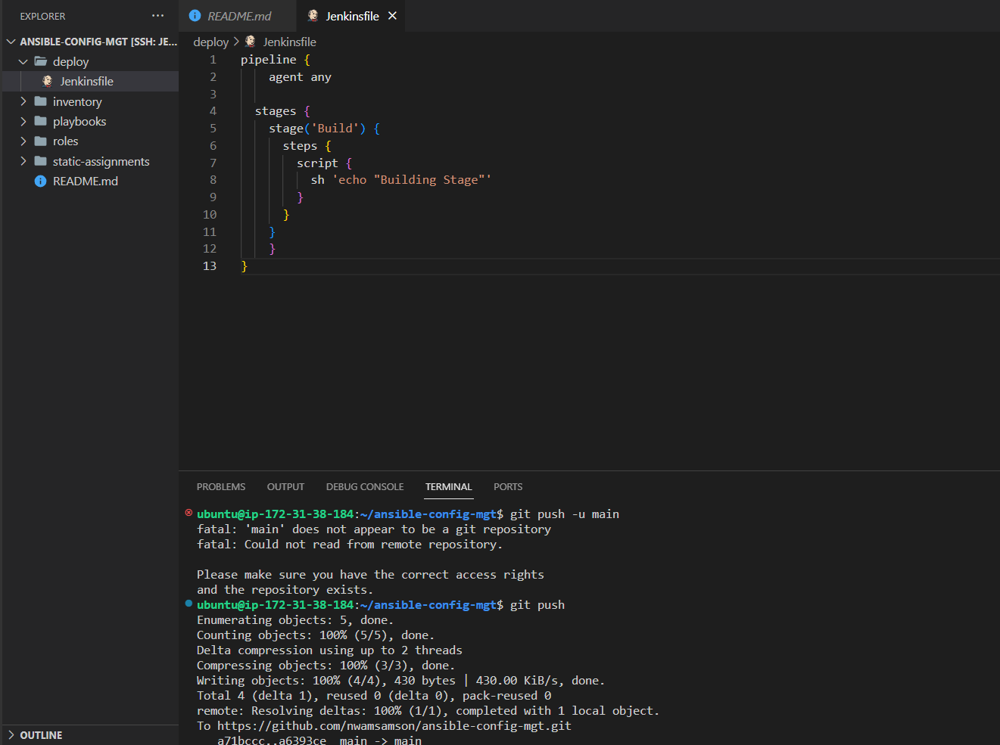

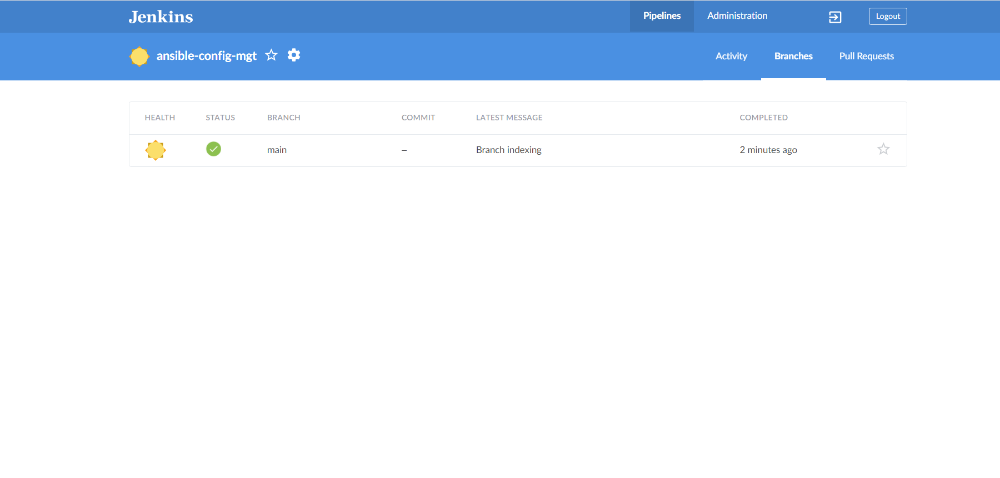

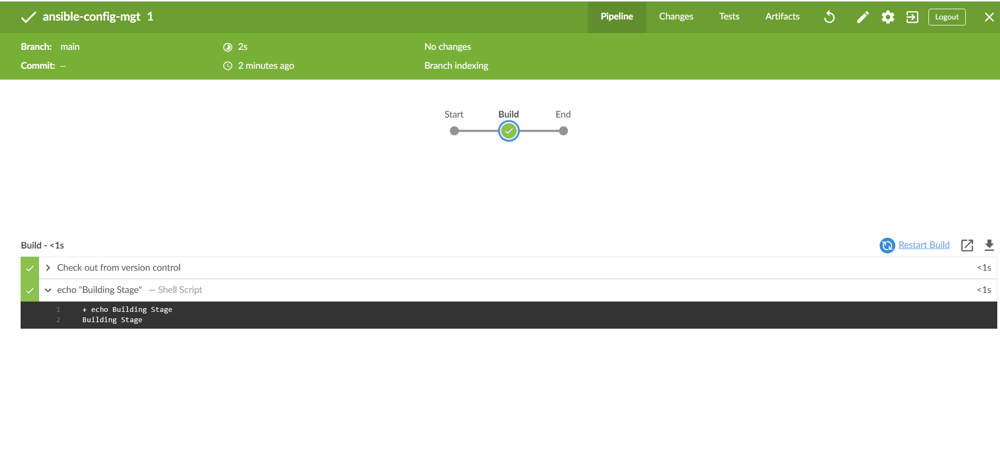

## RUNNING ANSIBLE PLAYBOOK FROM JENKINS

Install Ansible on Jenkins Jenkins-Ansible Server.

Install Ansible plugin in Jenkins UI

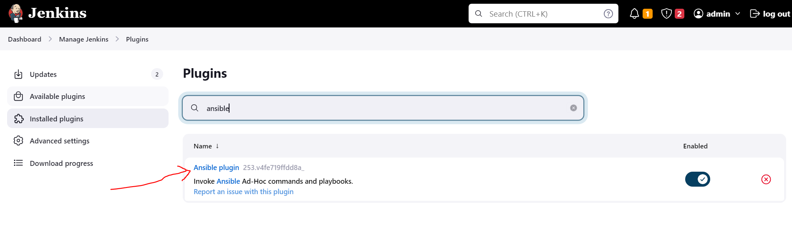

update the jenkins file with the code below.

Add the following code to the jenkinsfile
```
pipeline {
  agent any

  environment {
      ANSIBLE_CONFIG="${WORKSPACE}/deploy/ansible.cfg"
    }

  stages {
      stage("Initial cleanup") {
          steps {
            dir("${WORKSPACE}") {
              deleteDir()
            }
          }
        }

      stage('Checkout SCM') {
         steps{
            git branch: 'main', url: 'https://github.com/Micah-Shallom/ansible-config-mgt.git'
         }
       }

      stage('Prepare Ansible For Execution') {
        steps {
          sh 'echo ${WORKSPACE}' 
          sh 'sed -i "3 a roles_path=${WORKSPACE}/roles" ${WORKSPACE}/deploy/ansible.cfg'  
        }
     }

      stage('Run Ansible playbook') {
        steps {
           ansiblePlaybook become: true, credentialsId: 'private-key', disableHostKeyChecking: true, installation: 'ansible', inventory: 'inventory/dev, playbook: 'playbooks/site.yml'
         }
      }

      stage('Clean Workspace after build') {
        steps{
          cleanWs(cleanWhenAborted: true, cleanWhenFailure: true, cleanWhenNotBuilt: true, cleanWhenUnstable: true, deleteDirs: true)
        }
      }
   }

}
```

Jenkins needs to export the ANSIBLE_CONFIG environment variable. You can put the .ansible.cfg file alongside Jenkinsfile in the deploy directory. This way, anyone can easily identify that everything in there relates to deployment. Then, using the Pipeline Syntax tool in Ansible, generate the syntax to create environment variables to set. Enter this into the ancible.cfg file.

```
timeout = 160
callback_whitelist = profile_tasks
log_path=~/ansible.log
host_key_checking = False
gathering = smart
ansible_python_interpreter=/usr/bin/python3
allow_world_readable_tmpfiles=true


[ssh_connection]
ssh_args = -o ControlMaster=auto -o ControlPersist=30m -o ControlPath=/tmp/ansible-ssh-%h-%p-%r -o ServerAliveInterval=60 -o ServerAliveCountMax=60 -o ForwardAgent=yes


```

Let's include parameterization in the jenkinsfile. It has a default value incase if no value is specified at execution. It also has a description so that everyone is aware of its purpose. 

```
pipeline {
    agent any

    parameters {
      string(name: 'inventory', defaultValue: 'dev',  description: 'This is the inventory file for the environment to deploy configuration')
    }
}

```

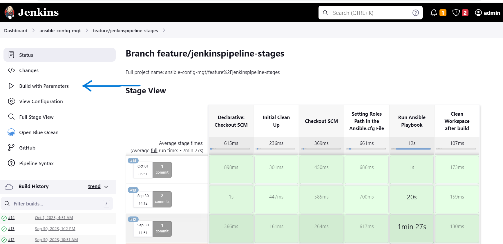


## CI/CD PIPELINE FOR TODO APPLICATION

Our goal here is to deploy the Todo application onto its server from the artifactory server.

- Updated Ansible with an Artifactory role. Install artifactory role from the Ansible galaxy repository.

- Now, open your web browser and type the URL <artifactory-publicip-address>. You will be redirected to the Jfrog Atrifactory page. Enter default username and password: admin/password. Once in create username and password and create your new repository. (Take note of the reopsitory name)

On our jenkins server, install git and then pull our php-todo application into our server

```
https://github.com/darey-devops/php-todo.git
```
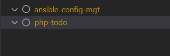

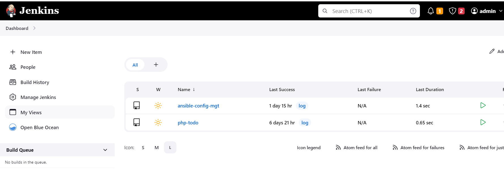

On the jenkins-ansible server, install the plot plugin and artifactory plugin and set it up. Add the artifactory server ip to the jfrog global config. 


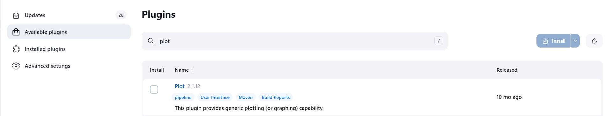

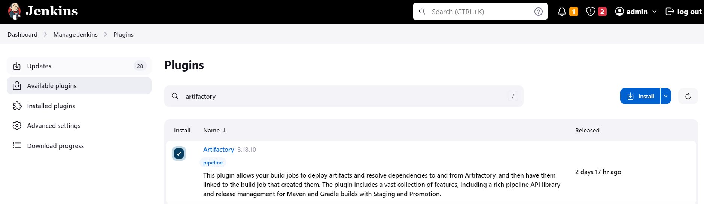

Run the jenkinsfile to trigger ansible playbook to set up artifactory on the server. Note: Remember to open the security ports for artifactory access

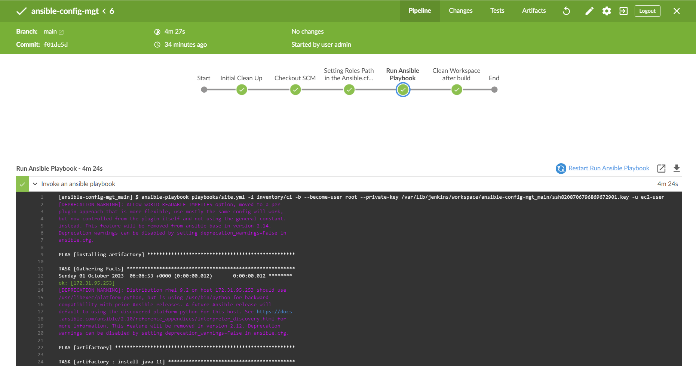

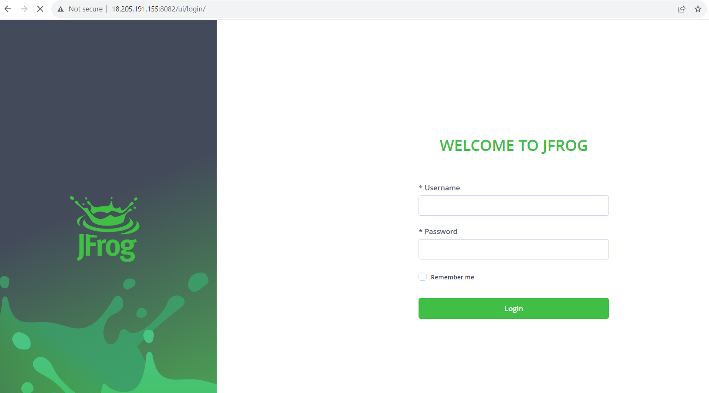

Configure artifactory in jenkins

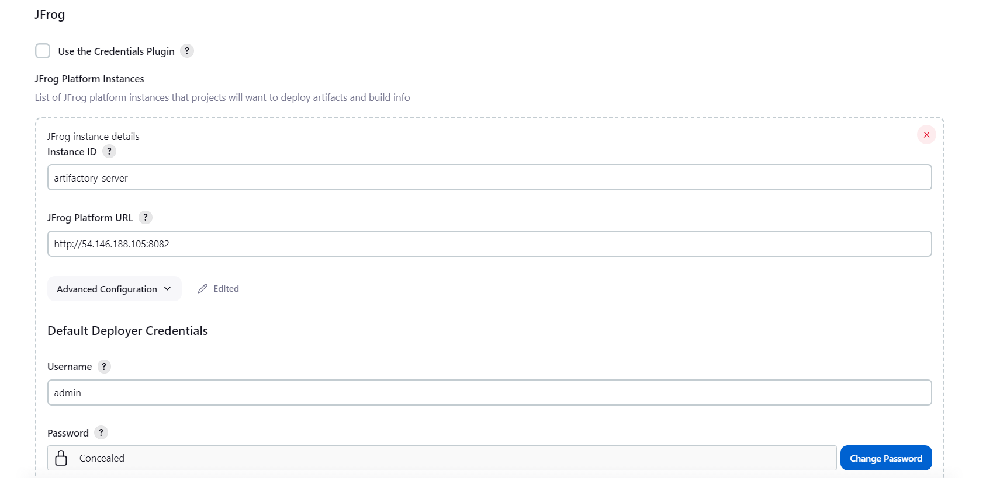

- In VScode create a new Jenkinsfile in the php-Todo repository
- Using Blue Ocean, create a multibranch Jenkins pipeline
- Install mysql client: sudo apt install mysql -y
- Login into the DB-server(mysql server) and set the the bind address to 0.0.0.0: sudo vi /etc/mysql/mysql.conf.d/mysqld.cnf
- Create database and user. NOTE: The task of setting the database is done by the MySQL ansible role
- Run the php-todo pipeline

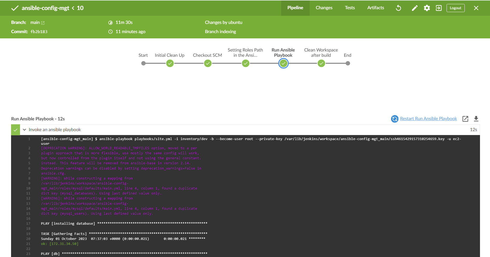

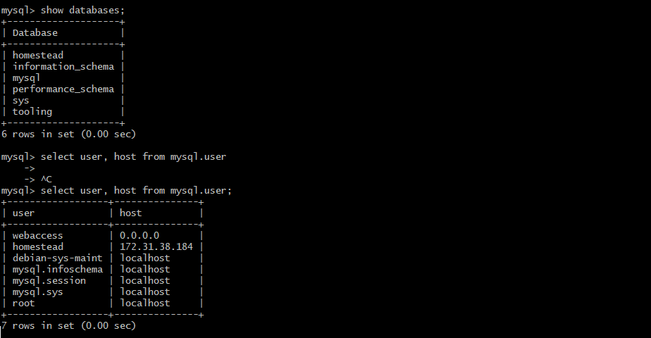

Update Jenkinsfile with proper pipeline configuration. In the Checkout SCM stage ensure you specify the branch as main and change the git repository to yours.

```
pipeline {
    agent any

  stages {

     stage("Initial cleanup") {
          steps {
            dir("${WORKSPACE}") {
              deleteDir()
            }
          }
        }

    stage('Checkout SCM') {
      steps {
            git branch: 'main', url: 'https://github.com/Micah-Shallom/php-todo.git'
      }
    }

    stage('Prepare Dependencies') {
      steps {
             sh 'mv .env.sample .env'
             sh 'composer install'
             sh 'php artisan migrate'
             sh 'php artisan db:seed'
             sh 'php artisan key:generate'
      }
    }
  }
}
```

NOTE: Ensure to update the msql connection parameters to reflect the latest server configurations in the .env files

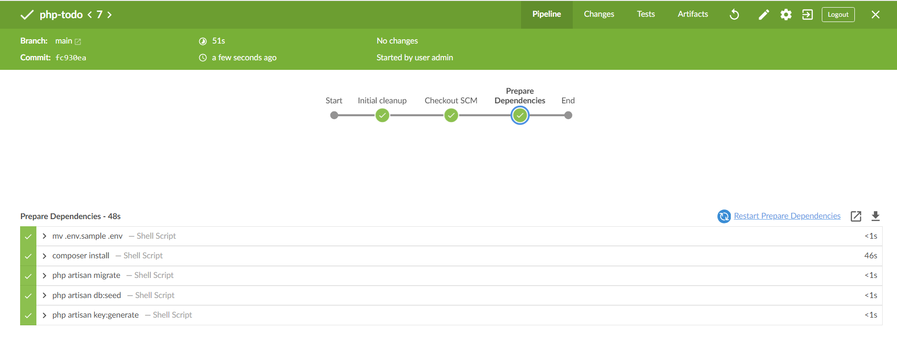

- Bundle the application code into an artifact and upload to artifactory (update the jenkinsfile)

```
stage ('Package Artifact') {
    steps {
            sh 'zip -qr php-todo.zip ${WORKSPACE}/*'
     }
    }
  
```

- Publish the resulted artifact into artifactory making sure 

```
stage ('Upload Artifact to Artifactory') {
          steps {
            script { 
                 def server = Artifactory.server 'artifactory-server'                 
                 def uploadSpec = """{
                    "files": [
                      {
                       "pattern": "php-todo.zip",
                       "target": "PBL/php-todo",
                       "props": "type=zip;status=ready"

                       }
                    ]
                 }""" 

                 server.upload spec: uploadSpec
               }
            }

        }

```


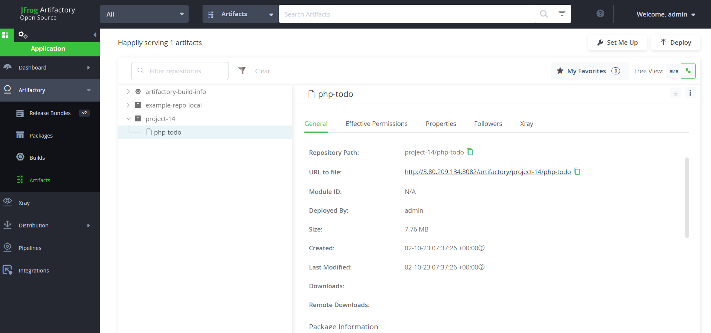

- Deploy the application to the dev environment by launching ansible pipeline and updating the jenkins file. 

```
stage ('Deploy to Dev Environment') {
    steps {
    build job: 'ansible-project/main', parameters: [[$class: 'StringParameterValue', name: 'env', value: 'dev']], propagate: false, wait: true
    }
  }

```

# SONARQUBE INSTALLATION

SonarQube is a tool that can be used to create quality gates for software projects, and the ultimate goal is to be able to ship only quality software code.

Despite that DevOps CI/CD pipeline helps with fast software delivery, it is of the same importance to ensure the quality of such delivery. Hence, we will need SonarQube to set up Quality gates. In this project we will use predefined Quality Gates (also known as The Sonar Way). Software testers and developers would normally work with project leads and architects to create custom quality gates.

## Setting Up SonarQube 

On the Ansible config management pipeline, execute the ansible playbook script to install sonarqube via a preconfigured sonarqube ansible role.

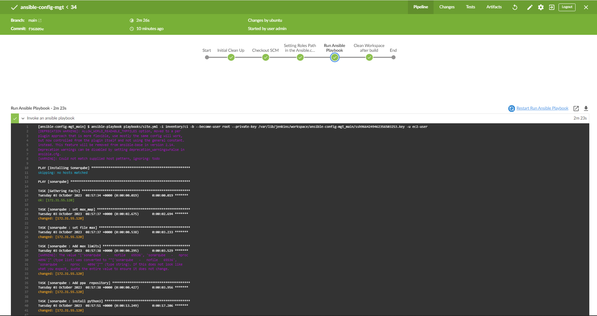

After the ansible pipeline is complete, access sonarqube on the browser '<sonarqube_server_url>:9000/sonar'

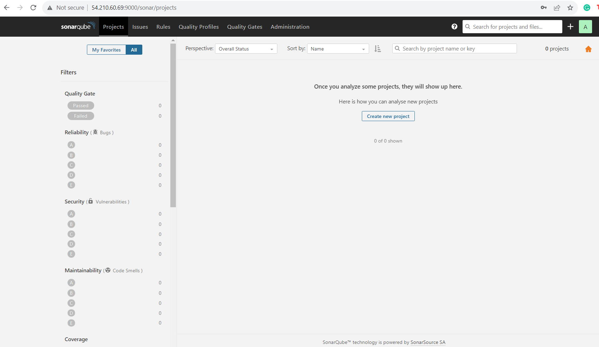

## CONFIGURE SONARQUBE AND JENKINS FOR QUALITY GATE 

- Install SonarQube Scanner plugin

- Navigate to configure system in Jenkins. Add SonarQube server: Manage Jenkins > Configure System

- To generate authentication token in SonarQube to to: User > My Account > Security > Generate Tokens


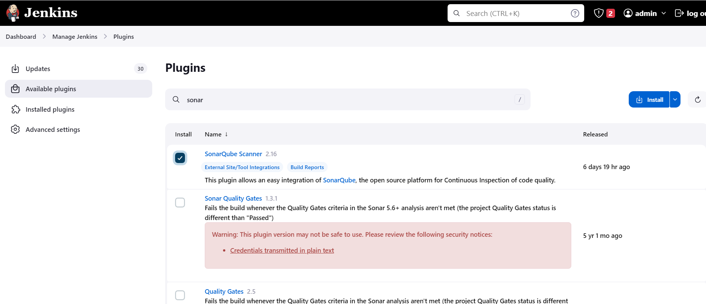

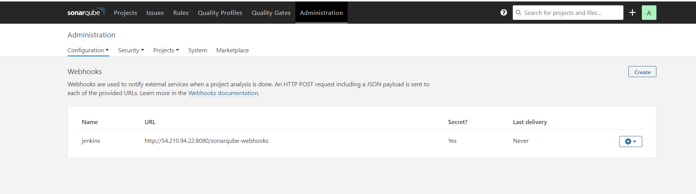

- set up sonarscanner from Jenkins - Global Tool Configuration. Go to Manage Jenkins > Global Tool Configuration 
- update jenkins pipeline to include sonarqube scanning and quality gate. ensure it is placed before the 'package artifact stage' this is to make sure we have high quality artifacts. 

```
stage('SonarQube Quality Gate') {
    environment {
        scannerHome = tool 'SonarQubeScanner'
    }
    steps {
        withSonarQubeEnv('sonarqube') {
            sh "${scannerHome}/bin/sonar-scanner"
        }

    }
}

```

Note: 
- Configure sonar-scanner.properties – From the step above, Jenkins will install the scanner tool on the Linux server. You will need to go into the tools directory on the server to configure the properties file in which SonarQube will require to function during pipeline execution. cd /var/lib/jenkins/tools/hudson.plugins.sonar.SonarRunnerInstallation/SonarQubeScanner/conf/.
- Open sonar-scanner.properties file: sudo vi sonar-scanner.properties
- Add configuration related to php-todo project

```
sonar.host.url=http://<SonarQube-Server-IP-address>:9000
sonar.projectKey=php-todo
#----- Default source code encoding
sonar.sourceEncoding=UTF-8
sonar.php.exclusions=**/vendor/**
sonar.php.coverage.reportPaths=build/logs/clover.xml
sonar.php.tests.reportPath=build/logs/junit.xml 

```

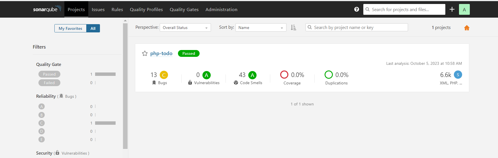

We will be including quality gates in other to ensure that the pipeline fails when the code quality does not meet specific requirements. 

```

stage('SonarQube Quality Gate') {
      when { branch pattern: "^develop*|^hotfix*|^release*|^main*", comparator: "REGEXP"}
        environment {
            scannerHome = tool 'SonarQubeScanner'
        }
        steps {
            withSonarQubeEnv('sonarqube') {
                sh "${scannerHome}/bin/sonar-scanner -Dproject.settings=sonar-project.properties"
            }
            timeout(time: 1, unit: 'MINUTES') {
                waitForQualityGate abortPipeline: true
            }
        }
    }
```
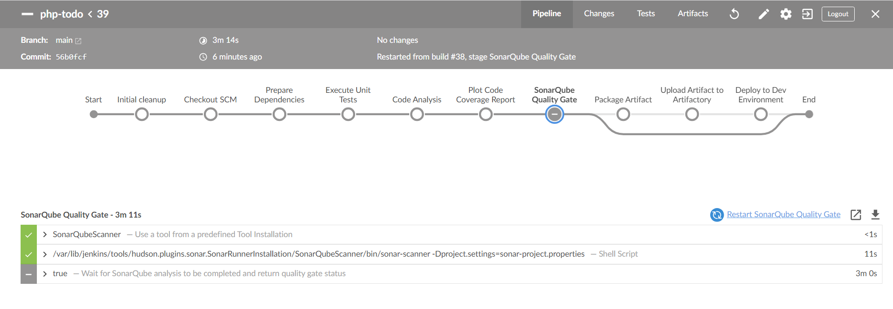


